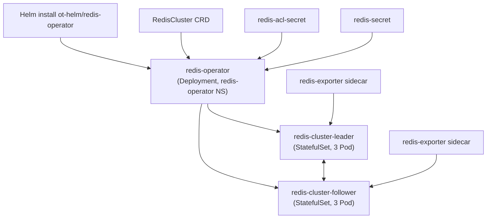

# Redis Cluster 部署方案

## 方案选择

本方案采用 **OT-CONTAINER-KIT redis-operator**，通过 Helm Chart `ot-helm/redis-operator` 安装 Operator，再用 `RedisCluster` Custom Resource 声明 3 主 3 从（共 6 节点）Redis Cluster。

Operator 负责持续 reconcile 集群拓扑、ACL 配置挂载、PVC 生命周期管理和 redis-exporter sidecar 注入，适合 Kubernetes 环境的生产级 Redis Cluster 部署。

## 版本基线

- Operator Helm Chart：`ot-helm/redis-operator`
- Operator Image Tag：`latest`
- Operator Namespace：`redis-operator`
- Cluster Namespace：`redis`
- Redis CRD：`RedisCluster` (`redis.redis.opstreelabs.in/v1beta2`)
- Redis 版本：`clusterVersion: v8`（镜像 `quay.io/opstree/redis:latest`）
- Cluster 规格：3 主节点 + 3 从节点，共 6 个 Pod
- 认证：ACL 文件（`/etc/redis/user.acl`）+ 密码 Secret
- 监控：redis-exporter sidecar（可选 Prometheus ServiceMonitor）

## 前置条件

| 项目 | 要求 |
|---|---|
| Kubernetes | >= 1.21 |
| Helm | >= 3.x |
| StorageClass | `standard` (支持 ReadWriteOnce 动态制备) |
| Worker Node | **>= 6 个**（硬性反亲和性，每个 Pod 独占一个节点） |
| Prometheus Operator | 可选，仅 ServiceMonitor 需要 |

> [!IMPORTANT]
> 反亲和性为 **硬性策略** (`requiredDuringSchedulingIgnoredDuringExecution`)，可用 Worker Node < 6 时 Pod 将处于 Pending 状态。

## 架构



## 文件结构

```
redis/
├── deploy.sh                          # 一键部署脚本
├── cleanup.sh                         # 一键清理脚本
├── manifests/
│   ├── 01-namespace.yaml              # 命名空间 (redis-operator + redis)
│   ├── 02-acl-secret.yaml            # ACL 规则 Secret
│   ├── 03-redis-password-secret.yaml # default 用户密码 Secret
│   ├── 04-redis-cluster.yaml         # RedisCluster CR（核心）
│   └── 05-servicemonitor.yaml        # Prometheus ServiceMonitor（可选）
├── PLAN.md                            # 本文件：方案说明与架构图
├── OPERATIONS.md                      # 操作手册：部署、验证、运维、排障
└── RESOURCES.md                       # 资源清单与官方资料
```

## 用户与 ACL 说明

| 用户名 | 密码 Secret | key 权限 | 命令权限 | 用途 |
|---|---|---|---|---|
| `default` | `redis-secret` | `~*` | `+@all` | 应用默认连接用户 |
| `opstree` | ACL 文件内嵌 | `~*` | `+@all` | Operator 内部使用 |
| `buildpiper` | ACL 文件内嵌 | `~*` | `+@all` | CI/CD 系统 |
| `test` | ACL 文件内嵌 | `~*` | `+@all` | 测试专用 |

## 存储规划

每个 Pod 申请 2 个 PVC，6 节点共 12 个 PVC：

| PVC 类型 | 大小 | 数量 | 用途 |
|---|---|---|---|
| `data-volume` | 5Gi | 6 | Redis 数据 |
| `node-conf-volume` | 1Gi | 6 | `nodes.conf` (集群必须) |

合计：**36Gi**
